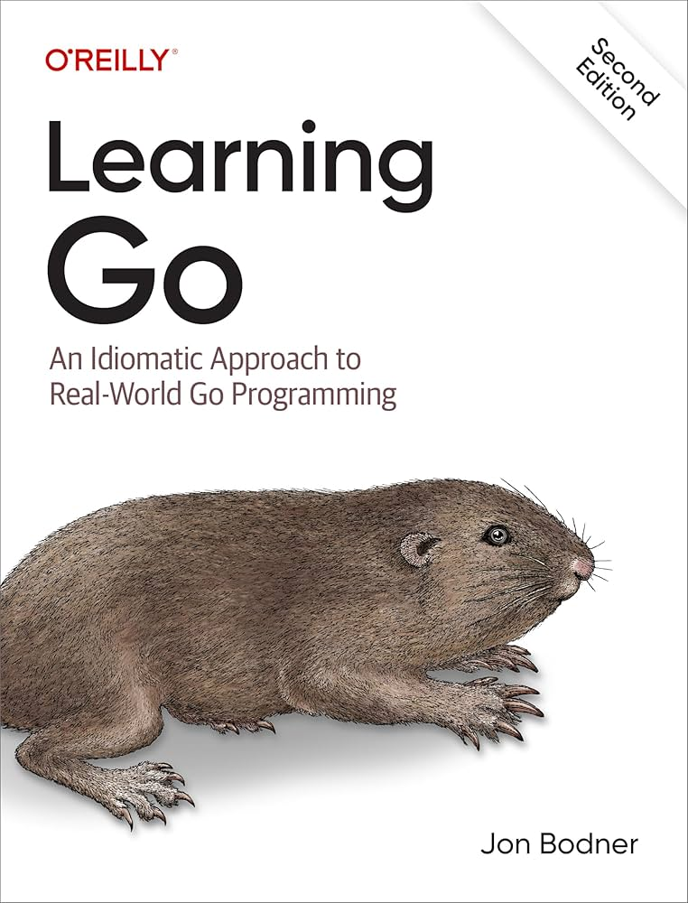

# Learning Go

<!--toc:start-->
- [Learning Go](#learning-go)
  - [Overview](#overview)
  - [First of all why Go?](#first-of-all-why-go)
  - [Resources I've used and using](#resources-ive-used-and-using)
  - [Some of today's thoughts](#some-of-todays-thoughts)
  - [Conclusion](#conclusion)
<!--toc:end-->

&nbsp;

## Overview

&nbsp;
This post is going to talk about the journey of me learning go and some of the some of the resources I'm using or used to learn it. Also my today's thoughts.

&nbsp;

## First of all why Go?

&nbsp;
I'm not going to get into all the specifics on go but I will highlight why personally I chose go.

&nbsp;

```go
func main(){
  fmt.Println("1. Its Simple")
  fmt.Println("2. Every program compiles to a single binary.")
  fmt.Println("3. Compile speed is lightening fast")
  fmt.Println("4. Small footprint, so takes less resources to run")
  fmt.Println("5. Great for lambda functions/cloud services")
  fmt.Println("6. Good mix of high/low level features")
}
```

&nbsp;

## Resources I've used and using

&nbsp;


&nbsp;
I just bought the book above for my kindle. Because I've seen really good reviews for it so I'm going to spent sometime over Christmas reading it and to see if I can learn something new.

&nbsp;
Some people that I've learned a lot from are Anthony GG, Melkey, Lane from boot.dev and Akhil Sharma to name a few.
I have done a lot of tutorials and you could say I'm kinda in or was in tutorial hell. I think the best way to learn is to build projects.

&nbsp;
Building projects is good way to learn and to stay motivated. That's why I built this website. My old website was just a index file hosted out of a s3 bucket and it was on a CI/CD pipeline with github actions and terraform.

&nbsp;

## Some of today's thoughts

&nbsp;
I will say at times I do question myself on why I would want to learn how to code because of AI. I personally think to much AI is bad thing for this world. Just think of how many students right now use chatgpt for their assignments.

&nbsp;
I think AI is a tool can be a good thing but if your simply relying on AI I do think its a bad thing. If you just copy and paste code how are you going to learn? I only use chatgpt when I have to. Its good for being a reference like small tasks and stuff.

&nbsp;
Going back kinda to my last post I think the tech market is oversaturated at the moment. That's why I'm trying to pivot to help desk jobs because I might have a lot more success trying to get to them.

&nbsp;

## Conclusion

&nbsp;
This post was more about go and the resources I've used and using to continue to learn it. Also touched on some of my views of AI and the current tech market.
